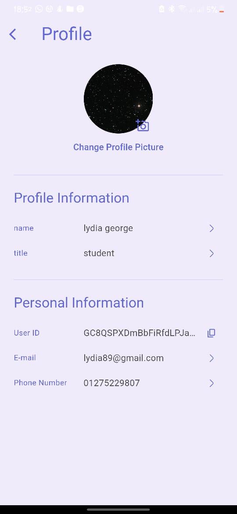

# neat
Business Task Organizer 

An application that enables the company to organize tasks between groups and follow up on task progress with an annual evaluation
Like (Click up)

packages 
- Firebase Core
- flutter_local_notifications
- state management (bloc)
- Flutter UUid
- shared_preferences
- pie_chart
- image_picker
- image_picker
- emoji_picker_flutter:
- percent_indicator

  Fetures
  - updates tasks ("To Do," "In Progress," "Completed")
  - Chat
  - Performance Tracking
  - Supports light and dark modes
  - Change Profile Info
  - Tasks tracking
  - Notifications
 

  

  

